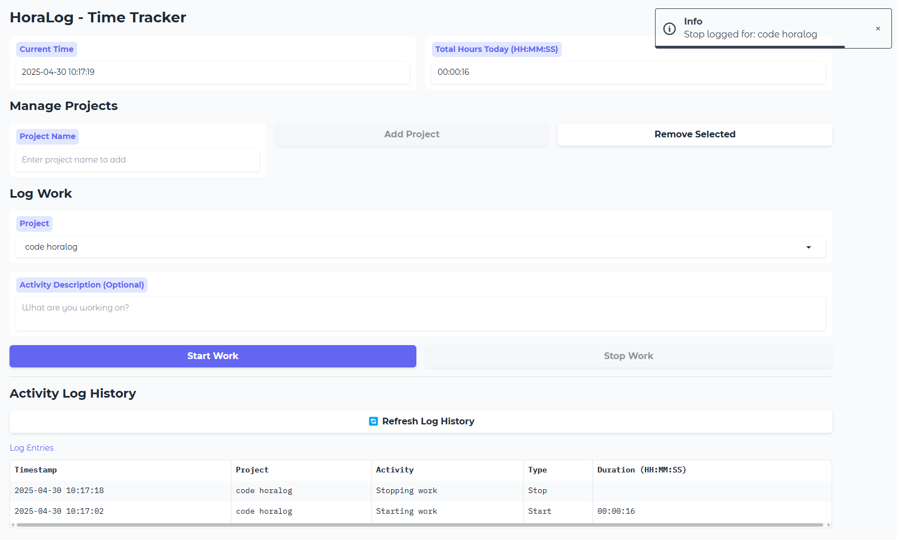

# HoraLog - Simple Gradio Time Tracker ⏳

HoraLog is a simple, self-hosted web application built with Python and Gradio to help you track the time you spend on different projects throughout the day.



## Features ✨

*   **Real-time Clock:** Displays the current time, updating every second.
*   **Project Management:**
    *   Add new projects to your list.
    *   Remove projects from the list.
    *   Project list persists in `projects.txt`.
*   **Work Logging:**
    *   Start tracking time for a selected project with an optional activity description.
    *   Stop tracking time for the currently running project.
*   **Concurrency Control:** Prevents starting a new task if another task is already running.
*   **State Validation:** Prevents stopping a task if no task is running or if the wrong project is selected.
*   **Log History:** Displays a table of all start/stop events.
*   **Duration Calculation:** Shows the calculated duration (`HH:MM:SS`) for each completed work interval in the history.
*   **Live Daily Total:** Displays the total hours worked today (`HH:MM:SS`), updating in real-time if a task is active.
*   **Persistent Storage:** Work logs are saved to `work_log.csv`.
*   **Manual Refresh:** A button to manually refresh the log history display.
*   **Simple Web UI:** Runs as a local web server accessible from your browser.

## Prerequisites 📋

*   **Python:** Version 3.8 or higher recommended.
*   **pip:** Python package installer (usually included with Python).

## Installation & Setup ⚙️

1.  **Clone or Download:**
    ```bash
    git clone https://github.com/weberhen/horalog
    cd horalog
    ```

2.  **(Recommended) Create a Virtual Environment:**
    ```bash
    # For Linux/macOS
    python3 -m venv venv
    source venv/bin/activate

    # For Windows
    python -m venv venv
    .\venv\Scripts\activate
    ```

3.  **Install Dependencies:**
    Install the required Python libraries using pip.
    ```bash
    pip install gradio pandas
    ```

## Running the Application ▶️

1.  **Navigate:** Open your terminal or command prompt and navigate to the `horalog` directory where `main.py` is located.
2.  **Run:** Execute the main script:
    ```bash
    python main.py
    ```
3.  **Access:** The terminal will show output like:
    ```
    Running on local URL:  http://0.0.0.0:7860
    ```
    Open your web browser and go to `http://127.0.0.1:7860` or `http://localhost:7860`. If you see `0.0.0.0`, you might also be able to access it from other devices on your local network using your computer's local IP address (e.g., `http://192.168.1.100:7860`).
4.  **Stop:** To stop the application server, go back to the terminal where it's running and press `Ctrl + C`.

## How to Use 🖱️

1.  **Add Projects:** Use the "Project Name" text box under "Manage Projects" and click "Add Project". Your projects will appear in the main "Project" dropdown and be saved to `projects.txt`.
2.  **Select Project:** Choose the project you are about to work on from the "Project" dropdown under "Log Work".
3.  **Start Work:** Optionally type a description in "Activity Description", then click "Start Work". The button will become disabled, and the "Stop Work" button will become enabled. The "Total Hours Today" counter will start incrementing if this is the first task of the day or continue from previous intervals.
4.  **Stop Work:** When you finish working on the *currently running* task, ensure the *correct project* is still selected in the dropdown, then click "Stop Work". The "Start Work" button will become enabled again, and the "Stop Work" button will disable. The log history will update, showing the calculated duration for the interval you just finished.
5.  **Switch Tasks:** To switch directly from Project A to Project B:
    *   Select Project A and click "Stop Work".
    *   Select Project B and click "Start Work".
6.  **Remove Project:** Select a project from the *main* "Project" dropdown and click "Remove Selected" under "Manage Projects".
7.  **Refresh History:** Click the "🔄 Refresh Log History" button if you need to manually reload the log display from the CSV file (e.g., if you manually edited the file).

## Data Storage 💾

The application uses two simple text files for persistence, created in the same directory as `main.py`:

*   **`projects.txt`:** A plain text file storing your project names, one per line.
*   **`work_log.csv`:** A Comma-Separated Values file storing your work history. Columns include:
    *   `Timestamp`: Date and time of the event (YYYY-MM-DD HH:MM:SS).
    *   `Project`: The name of the project.
    *   `Activity`: The optional description entered.
    *   `Type`: Indicates if the entry is a 'Start' or 'Stop' event.

**Important:** Back up these files regularly if your time tracking data is critical!

## Future Improvements 💡

*   Editing or deleting past log entries.
*   Filtering or searching the log history.
*   Basic reporting (e.g., weekly totals per project).
*   More visual feedback about the currently running task.
*   User accounts / authentication (if needed for multiple users).
